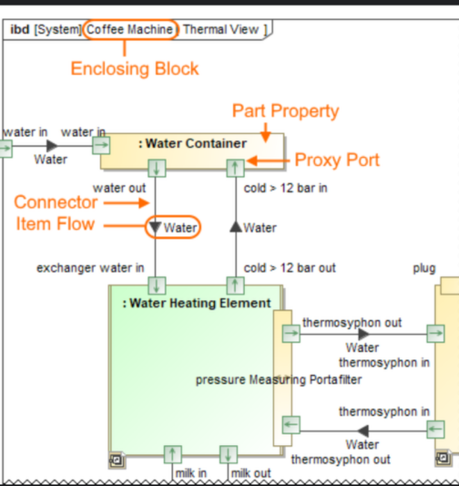

`Please provide the information in which domain and aspect the vp is in the header. You may link to the domain and aspect, but it is not mandatory for a viewpoint proposal.`

|**Domain**|**Aspect**|**Maturity**|
| --- | --- | --- |
|Common|Taxonomy&Structure|Proposed|

## Example
`Please provide an example image drawing or sketch how the viewpoints presentation shoule be. just dump the files into the repo and link them` 

## Purpose
`Please describe the purpose of the vp - see other viewpoints for examples`
The Sample Viewpoint serves as an example how to contribute a viewpoint proposal.

## Applicability
`Please describe how the viewpoint supports SE, especially iso 15288 and related standards or artefacts`
The Sample Viewpoint contributes to the iso 15288 information management process.

## Presentation
`Please provide a list of presentation descriptions of the vp. Is it a table ?is there an alternative presentation? `
* The Sample Viewpoint is presented as IBD with parts and connectors.
* The Sample Viewpoint may also be presented as a table showing the connectors and connected parts and ports

## Stakeholder
`Please provide a list of stakeholders intersted in the vp because they have concerns framed by the vp. Please reuse existing stakeholdes if applicable. You may link to existing Stakeholders, or just write down their names`
* [System Architect](../stakeholders.html#_19_0_2_ebf0350_1555170687022_190510_43698)
* Software Developer
* A new Stakeholder

## Concern
`Please provide a list of concerns framed by the vp. Please reuse concerns if applicable, link to them or just write down their names`
* how do i contribute a viewpoint to SAF ?
* [Which viewpoints are used in the system model](../concerns.html#_2021x_2_8710274_1696579743010_350358_24968)

## Profile Model Reference
`Please provide a list of stereotypes used by the viepoint. Please reuse existing stereotypes if applicable, link to them or just write down their names. For a new stereotype it should be added of what metaclas it is, or the general stereotype if it is inherited from an other stereotype`
The following Stereotypes / Model Elements are used in the Viewpoint:
* [SAF_Standard](../stereotypes.html#_2021x_2_8710274_1700810557668_637315_48235)
* SAF_my_newly_proposed_stereotype -> Activity
* SAF_my_other_proposed_stereotype => SysML::Block
* SAF_my_third_proposed_stereotype => SAF_SystemFunction

## Related Viewpoints
### Required Viewpoints
`Please provide a list of viewpoints that must be in the model for this viewpoint to work`

* [System Use Case Viewpoint](../Functional%20Domain/System%20Use%20Case%20Viewpoint.html)

### Recommended Viewpoints
`Please provide a list of viewpoints that are good to have in the model for this vp, but might be omitted and this vp still works`

* [Operational Story Viewpoint](../Operational Domain/Operational Story Viewpoint.html)
